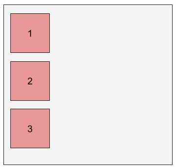
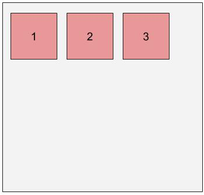
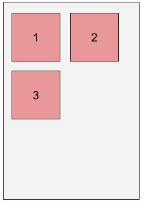
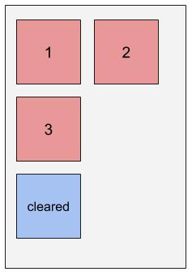

# HTML & CSS Layout

## Preparation

1.  [Fork and clone](https://github.com/ga-wdi-boston/meta/wiki/ForkAndClone)
    this repository.
1.  Create three new branches, `training`, `float-site`, and `lookalike-site`.
1.  Install dependencies with `npm install`.

## Objectives

Students should, at the end of the lesson, be able to:

-   Establish spacing inside and outside of elements using margin and padding.
-   Explain the difference between different types of distance measurement in a web
page, including 'px', '%', and 'em'.
-   Use 'float' and 'clear' to stack elements alongside each other.
-   Employ media queries to change CSS rules based on screen size.
-   Explain the difference between 'static' and 'fixed' positioning.

## Basic CSS Positioning

So far, we've mostly talked about using CSS for styling our page - adding
colors, fonts, etc. Next, we'll be examining how CSS can be used to control a
webpage's layout.

Back in the 90s, layout was accomplished using tables (`<table>`), which had
rows (`<tr>`) and row subdivisions (`<td>`). However, this was problematic for
several reasons:

1.  Layout was hard-coded into the page - it couldn't easily be adjusted.
2.  As a result of (1), keeping layout consistent between multiple pages was
tedious.
3.  Nesting tables within tables quickly became a nightmare; how could you tell
apart the `<tr>` of one level from the `<td>` of another?
4.  It wasn't very semantic - our markup would always say 'table', even though our
content was typically not a table.

Using CSS to control our layout addressed all of these issues. What's more, it
effectively abstracted away the _layout_ of our page from the _content_ of our
page.

### Dimensions: Box Model

In addition to setting an element's `height` and `width`, elements have three
other properties that explicitly control spacing:

1.  'Border' sets a perimeter around an element. In addition to specifying a color
and a particular type of border, you can also specify a thickness.
2.  'Margin' specifies spacing between the outside of an element's border and any
adjacent elements.
3.  'Padding' specifies spacing between the inside of an element's border and the
contents of that element (which includes `height` and `width`!)

Together, these attributes form _the box model_, a way of describing the space
taken up by an element.

_Note: an element's size is determined by its content's height and width.Border, margin, and padding add to that size._
_To calculate those into the element's size, the element's CSS [`box-sizing`](https://developer.mozilla.org/en-US/docs/Web/CSS/box-sizing) property should be changed from the default `content-box` to `border-box.`_


Every one of these attributes, including `height` and `width`, can be specified
in the following terms:

-   `px` : fixed number of pixels
-   `%`  : size is relative to element that contains it ("parent"). As a value of
`height`, `%` is relative to the parent's `height`, but for every other
dimension, `%` is relative to the parent's `width` value.
-   `em` : ties dimensions to *font size* - one `em` is the width of the letter 'm'.
For all dimensions except `font-size`, `em` will refer to the font size of the
element; as a value for `font-size`, `em` refers to the font size of the
*parent*

### Float and Clear

Block elements, as a rule, always stack vertically - never side by side. Each
block element effectively has a 'new-line' built into it, forcing the next piece
of content down.



This can be circumvented using the `float` property; floated elements act like
words within a block of text, wrapping around the screen when it is too narrow
to display the entire line.





Like words, floated elements can be stacked from left-to-right (_left-floated_)
or from right-to-left (_right-floated_)

To make something fall beneath a set of floated elements, rather then wrapping
around it, you can use the `clear` attribute; set clear to `left` to clear a
`left` float, `right` to clear a `right` float, or `both` to clear either kind
of float.

### Code Along: Float Demonstration

Working on our `training` branch, let's use the example HTML code to
demonstrate floating.



> Ordinarily, elements expand to hold their containers. However, floated
> elements are excluded from this, so floating an element may lead to its
> container's height shrinking down to nothing. To fix this, we use a "cleafix
> hack" by applying `overflow: hidden;` to the container's style declarations.

### Lab: Basic Positioning (Dimensions, Float/Clear)

Working with your squads on the `float-site` branch, use
 [index.html](index.html) to create simple look-alikes that mimic the layout
(but **not** the actual content) of one of the following sites, using what
 you've learned about so far about CSS positioning (including margin, padding,
float and clear).

-   [Boston Globe](http://bostonglobe.com)
-   [Wikipedia](http://en.wikipedia.org/wiki/Main_Page)
-   [Reddit](http://reddit.com)

## Advanced CSS Positioning

### Media Queries

Using `%` dimensions allows you, to a certain degree, to account for a variety
of screen sizes by scaling up linearly. Sometimes, however, you don't want to
scale linearly; instead you want size to be fixed sometimes, to scale linearly
at others, or even to disappear entirely at a certain size.

Fortunately, CSS has a tool called a **media query** designed for this specific
use case.

```css
@media (max-width: 700px) {
  div {
    width: 300px;
    height: 300px;
  }
}
```

A media query acts a little like an `if` statement for your CSS; it will
_selectively hide or show_ the CSS it contains based on whether or not the
condition in the query comes back as `true`.

Media queries can often be thought of blocks of CSS that override existing
styles from your stylesheet (although they can do much more than this). They,
therefore, are always placed at the bottom of your stylesheet.

Here are some properties that can be used to build media queries:

-   min-width : CSS is visible at all screen widths **larger** than the given value.
-   max-width: CSS is visible at all screen widths **smaller** than the given value.
-   min/max-resolution :  CSS is visible above/below a given resolution.gi

### Lab: Media Queries

Revisit the basic site from the previous `float-site` branch exercise, and add
a new effect that triggers when you shrink the screen below 800px wide.

## Static vs Fixed Positioning

All of the rules that you've learn so far are based on one paradigm of
positioning, called 'static' positioning. However, it's possible to change this
paradigm and employ a different approach for positining elements using the
`position` attribute.

Though there are others, the most significant type of positioning besides
`static` positioning is `fixed` positioning. `fixed` positioning defines the
position of an element with respect to the _view window_, essentially 'fixing'
its position on the screen. Fixed positioning is frequently used in parallax
scrolling, or for holding a navigation bar at the top/side/bottom of the screen.

```css
.bar {
  position: fixed;
  left: 130px;
}
```

### Lab: Static vs Fixed Positioning

Switch to the `lookalike-site` branch and work in your squads to create your own
 look-alike for the following websites. Try to use fixed positioning at least
once.

-   [You Tube](https://youtube.com)
-   [Twitter](https://twitter.com/GA)
-   [Artisan Asylum](http://artisansasylum.com/)

### Further Practice: Relative and Absolute Positioning

[Research](https://developer.mozilla.org/en-US/docs/Web/CSS/position) relative
 and absolute positioning in CSS. How are they used? A helpful reference for
understanding is [this CSS-tricks blog post](https://css-tricks.com/absolute-positioning-inside-relative-positioning/).

## [License](LICENSE)

Source code distributed under the MIT license. Text and other assets copyright
General Assembly, Inc., all rights reserved.
